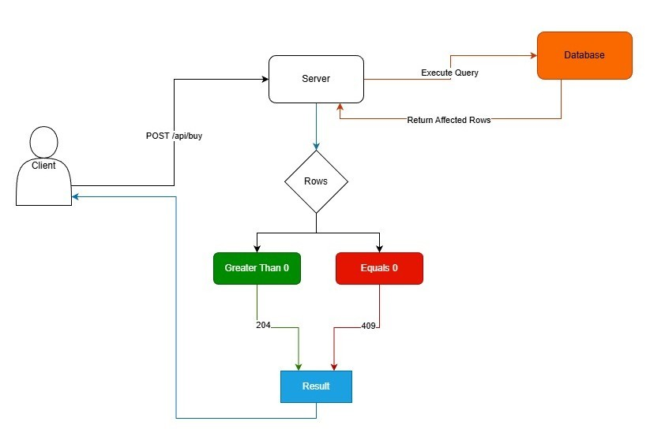

# System Design — Golden Ticket Drop

This document explains the architecture diagram, concurrency strategy,
and scalability of the Golden Ticket system.

---

## Architecture Diagram

The system follows a simple client-server-database when a user attempts to buy a ticket:



Flow:

1. User clicks "Buy"
2. Frontend sends POST /buy request
3. Backend processes request
4. Database performs atomic update
5. Result is returned to the client

## Concurrency Strategy

### Problem
Multiple users may attempt to purchase the last remaining ticket at the same time. Without proper synchronization, this could result in overselling.

To prevent this, the system uses an atomic conditional update query.
```sql
UPDATE inventory i
SET i.quantity = i.quantity - 1
WHERE i.id = :id AND i.quantity > 0
```

This query ensures that:
- The quantity is decremented only if stock is available
- The operation is executed atomically by the database
- No explicit application-level locking is required

Result
- If the query affects 1 row, the purchase is successful   → HTTP 204 No Content is returned
- If the query affects 0 rows, inventory is sold out → HTTP 409 Conflict is returned

### Client Side Optimistic Updates
The frontend applies optimistic UI updates when submitting a purchase request.

The local inventory count is decremented immediately to provide instant feedback.

If the backend responds with 409 Conflict, the UI state is rolled back to the last consistent value and an error message is shown.

This improves perceived performance while preserving backend consistency.
## Scalability

### Limitations
Under high load, the main bottleneck is database write contention on the inventory row.
All purchase requests must compete for the same resource, which limits horizontal scalability.

### Handling 1 million users
If traffic increased to 1 million concurrent users, the main architectural improvement would be introducing a Redis-based atomic counter.

This introduces eventual consistency between Redis and the database and requires handling of failure scenarios (crash recovery, double writes, reconciliation).

- Maintain inventory count in Redis
- Use atomic DECR operations
- Persist confirmed purchases asynchronously to the database

## Testing Strategy

The backend includes integration and concurrency tests to validate correctness under load.

### Concurrency Stress Test

A multithreaded test simulates 150 concurrent purchase attempts against 100 available tickets.

- Uses ExecutorService and CountDownLatch
- Spawns parallel purchase requests
- Verifies that only 100 succeed
- Ensures no overselling occurs

This test validates that the database-level atomic update strategy works correctly under real contention.

## Candidate Notes &amp; Run Instructions

Clone the repository and follow the instructions below to run the application locally.
`git clone https://github.com/candogusyilmaz/golden-ticket.git`

### How to run (back-end) (java spring-boot maven)
1. Move into the backend directory `cd server`
2. Run `mvn spring-boot:run` to start the server
3. The server will be running at http://localhost:8080

### How to run (front-end) (react)
1. Move into the frontend directory `cd web`
2. Run `npm install` to install dependencies
3. Run `npm run dev` to start the development server
4. Open http://localhost:5173 in your browser to access the application

## Architectural decisions

- Used database-level atomic updates instead of application locks to ensure correctness under concurrency.
- Chose optimistic UI updates to improve perceived latency.
- Relied on REST semantics and HTTP status codes for clear client-server contracts.

## Known limitations / "If I had more time"

- Add rate limiting
- Bot protection (cloudflare, google recaptcha)
- Introduce idempotency keys to prevent duplicate purchases
- For extreme traffic spikes, a Redis-based distributed lock or queue-based reservation system (Kafka/RabbitMQ) could be introduced to serialize purchase requests and protect the database.